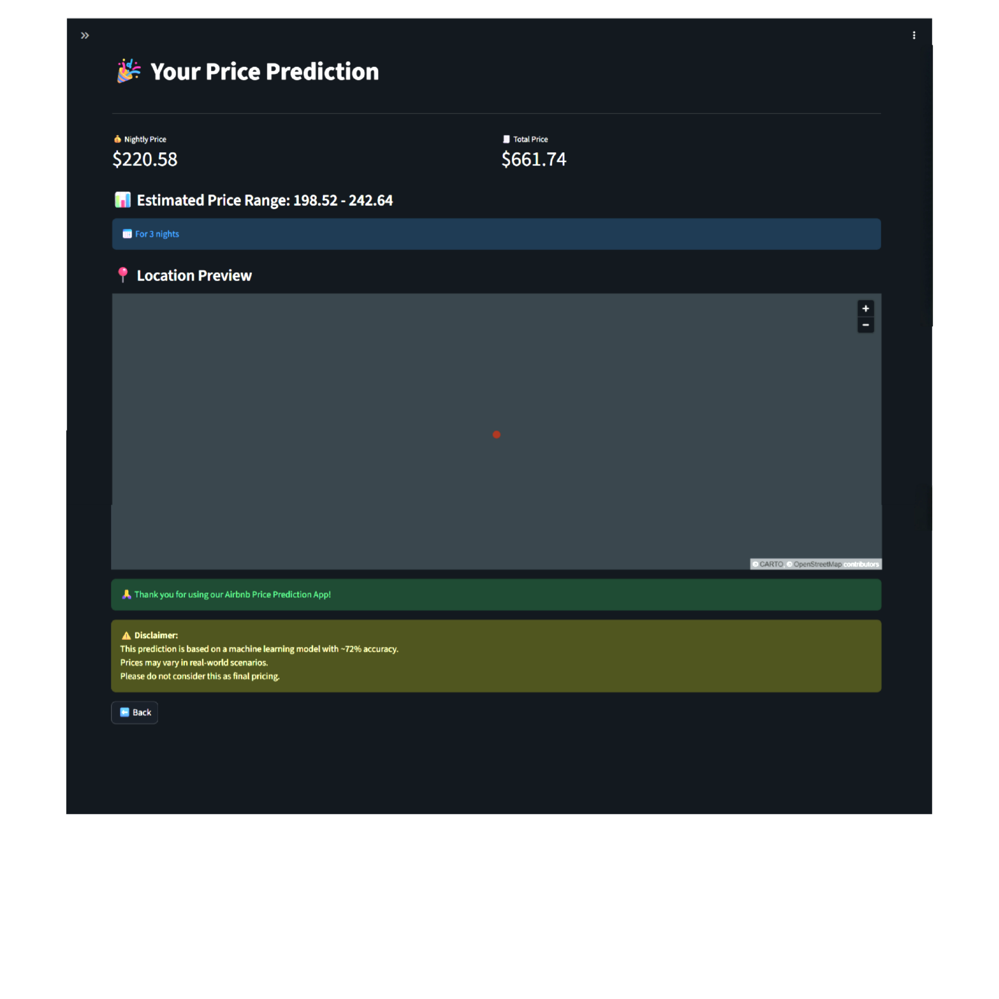

# End-to-End-Airbnb-Price-Prediction-ML-System

# 🏠 Airbnb Price Prediction System

An end-to-end Machine Learning project that predicts Airbnb listing prices based on property details, location, amenities, and host characteristics. The system is deployed as an interactive Streamlit web application with real-time predictions.

---

# Problem Statement

In the rapidly growing short-term rental market, pricing Airbnb listings is a complex task influenced by multiple factors such as location, property type, amenities, host experience, and customer reviews. 

Many hosts struggle to determine competitive pricing, while travelers find it difficult to assess whether a listing is reasonably priced. This lack of transparency leads to inefficient pricing strategies and poor decision-making.

This project aims to solve this problem by building a **data-driven machine learning system** that can accurately predict Airbnb prices and assist users in making informed decisions.

---

# Project Objectives

- Build an end-to-end ML pipeline for Airbnb price prediction  
- Automate data ingestion using Kaggle API  
- Perform data cleaning, preprocessing, and feature engineering  
- Train and compare multiple regression models  
- Select the best model based on performance metrics  
- Develop a real-time prediction system  
- Build an interactive web app using Streamlit  
- Deploy the application on AWS EC2  

---

# Project Overview

This project provides a complete pipeline from raw data to a deployed application:

- Collects data using Kaggle API  
- Cleans and preprocesses the dataset  
- Engineers meaningful features  
- Trains multiple ML models  
- Selects the best model (XGBoost)  
- Deploys a web app for real-time predictions  

---

## Dataset

- Source: Kaggle Airbnb Dataset
- Features include:
  - Property Type
  - Room Type
  - City
  - Amenities
  - Host Details
  - Reviews & Ratings

---

# 🔄 Project Pipeline (Stage-wise)

### Stage 1: Data Ingestion
- Download dataset using Kaggle API  

### Stage 2: Data Validation
- Check missing values, structure, and consistency  

### Stage 3: Data Preprocessing
- Handle missing values  
- Clean and format data  

### Stage 4: Feature Engineering
- Create features like:
  - Amenities count  
  - Host experience  

### Stage 5: Data Transformation
- One-hot encoding  
- Label encoding  
- Feature preparation  

### Stage 6: Model Training
- Linear Regression  
- Decision Tree  
- Random Forest  
- XGBoost  

### Stage 7: Model Evaluation
- Evaluate using R², MAE, RMSE  

### Stage 8: Prediction Pipeline
- Transform user input  
- Generate predictions  

### Stage 9: Web Application
- Build UI using Streamlit  

### Stage 10: Deployment
- Deploy on AWS EC2  

---

## 🔄 ML Pipeline Architecture

```text
┌────────────────────┐
│   Kaggle Dataset   │
└─────────┬──────────┘
          ↓
┌────────────────────┐
│  Data Ingestion    │
└─────────┬──────────┘
          ↓
┌────────────────────┐
│  Data Validation   │
└─────────┬──────────┘
          ↓
┌────────────────────────────┐
│ Data Preprocessing         │
│ - Missing values handling  │
│ - Data cleaning            │
└─────────┬──────────────────┘
          ↓
┌────────────────────────────┐
│ Feature Engineering        │
│ - Amenities count          │
│ - Host experience          │
└─────────┬──────────────────┘
          ↓
┌────────────────────────────┐
│ Data Transformation        │
│ - Encoding (OHE + Label)   │
│ - Feature scaling          │
└─────────┬──────────────────┘
          ↓
┌────────────────────────────┐
│ Model Training             │
│ LR | DT | RF | XGBoost     │
└─────────┬──────────────────┘
          ↓
┌────────────────────────────┐
│ Model Evaluation           │
│ R² | MAE | RMSE            │
└─────────┬──────────────────┘
          ↓
┌────────────────────────────┐
│ Best Model (XGBoost)       │
└─────────┬──────────────────┘
          ↓
┌────────────────────────────┐
│ Model Saving (joblib)      │
└─────────┬──────────────────┘
          ↓
┌────────────────────────────┐
│ Prediction Pipeline        │
│ - Input preprocessing      │
│ - Model inference          │
└─────────┬──────────────────┘
          ↓
┌────────────────────────────┐
│ Streamlit Web Application  │
└─────────┬──────────────────┘
          ↓
┌────────────────────────────┐
│ User Input → Prediction    │
│ Nightly Price + Total Cost │
└─────────┬──────────────────┘
          ↓
┌────────────────────────────┐
│ Deployment (AWS EC2)       │
└────────────────────────────┘
```
---

# Model Comparison

| Model                  | R² Score | MAE     | RMSE    |
|------------------------|----------|---------|---------|
| Linear Regression      | 0.5782   | 0.3974  | 0.5534  |
| Decision Tree          | 0.3948   | 0.4567  | 0.6501  |
| Random Forest          | 0.7058   | 0.3125  | 0.4802  |
| XGBoost (Best Model) ✅ | 0.7209   | 0.2987  | 0.4621  |

### 🏆 Best Model: XGBoost Regressor
- Highest accuracy  
- Lowest error  
- Best generalisation

---

# 📸 Screenshots

### 🏠 Home Page


### 📝 Input Form


### 🎉 Prediction Result


### 📍 Map View


---

---

